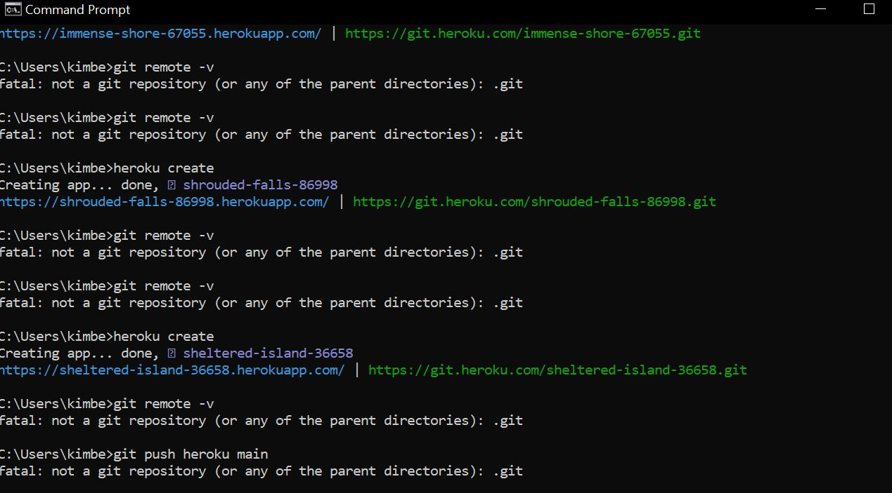

# note_taker

## Table of Contents
* [Description](#description)
* [Installation](#installation)
* [Usage](#usage)
* [Credits](#credits)
* [License](#License)

## Description
Create an application that can be used to write, save, and delete notes.

## Installation

To begin you will need to run an npm install inquirer. I also installed nodemon to monitor changes on my server.js and make sure that it remained open and updated. 

## Usage
* I was able to load the page locally but I was unable to load it using heroku. I tried using the guide but I ]repeatedly got errors. 

When I loaded the app locally I was able to see the landing page of the note taker and I could get to the screen where I could add a note. I was unable to save the notes / delete the notes. I think there may have been issues with the routes off my post and delete functions. I accidentally deleted my original package.json so I tried to obtain it again. 

## Resources
* npmjs
* expressjs
* https://docs.github.com/en/free-pro-team@latest/github/using-git/ignoring-files
* Met with TA to go over some questions as well

## License
MIT License 

Copyright (c) [2020] [Kimberley Torres]

Permission is hereby granted, free of charge, to any person obtaining a copy
of this software and associated documentation files (the "Software"), to deal
in the Software without restriction, including without limitation the rights
to use, copy, modify, merge, publish, distribute, sublicense, and/or sell
copies of the Software, and to permit persons to whom the Software is
furnished to do so, subject to the following conditions:

The above copyright notice and this permission notice shall be included in all
copies or substantial portions of the Software.

THE SOFTWARE IS PROVIDED "AS IS", WITHOUT WARRANTY OF ANY KIND, EXPRESS OR
IMPLIED, INCLUDING BUT NOT LIMITED TO THE WARRANTIES OF MERCHANTABILITY,
FITNESS FOR A PARTICULAR PURPOSE AND NONINFRINGEMENT. IN NO EVENT SHALL THE
AUTHORS OR COPYRIGHT HOLDERS BE LIABLE FOR ANY CLAIM, DAMAGES OR OTHER
LIABILITY, WHETHER IN AN ACTION OF CONTRACT, TORT OR OTHERWISE, ARISING FROM,
OUT OF OR IN CONNECTION WITH THE SOFTWARE OR THE USE OR OTHER DEALINGS IN THE
SOFTWARE.

