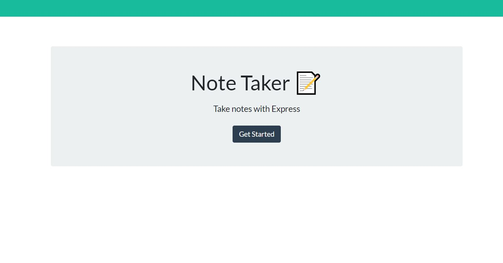

# note_taker

## Table of Contents
* [Description](#description)
* [Installation](#installation)
* [Usage](#usage)
* [Credits](#credits)
* [License](#License)

## Description
Create an application that can be used to write, save, and delete notes.

## Installation

To begin you will need to run an npm install inquirer. I also installed nodemon to monitor changes on my server.js and make sure that it remained open and updated that is just for the development phase. If using the deployed app you can just use the UI to guide you in creating notes/deleting notes, just make sure you run a node server.js in your terminal so that the local 
host is available. 

## Usage
* Once you run node server.js in your terminal you can use the deployed link to access the note taker.
* Using the buttons on the page you are guided to create / delete notes.

Some of the functionality is not working on my note app, the save and delete. I am still working through figuring out what needs to be fixed.

## Resources
* npmjs
* expressjs
* https://docs.github.com/en/free-pro-team@latest/github/using-git/ignoring-files
* Met with TA to go over some questions as well

## License
MIT License 

Copyright (c) [2020] [Kimberley Torres]

Permission is hereby granted, free of charge, to any person obtaining a copy
of this software and associated documentation files (the "Software"), to deal
in the Software without restriction, including without limitation the rights
to use, copy, modify, merge, publish, distribute, sublicense, and/or sell
copies of the Software, and to permit persons to whom the Software is
furnished to do so, subject to the following conditions:

The above copyright notice and this permission notice shall be included in all
copies or substantial portions of the Software.

THE SOFTWARE IS PROVIDED "AS IS", WITHOUT WARRANTY OF ANY KIND, EXPRESS OR
IMPLIED, INCLUDING BUT NOT LIMITED TO THE WARRANTIES OF MERCHANTABILITY,
FITNESS FOR A PARTICULAR PURPOSE AND NONINFRINGEMENT. IN NO EVENT SHALL THE
AUTHORS OR COPYRIGHT HOLDERS BE LIABLE FOR ANY CLAIM, DAMAGES OR OTHER
LIABILITY, WHETHER IN AN ACTION OF CONTRACT, TORT OR OTHERWISE, ARISING FROM,
OUT OF OR IN CONNECTION WITH THE SOFTWARE OR THE USE OR OTHER DEALINGS IN THE
SOFTWARE.

